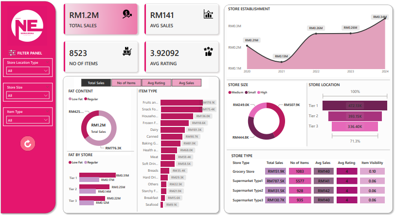

# 🛒 NEmart Power BI Report

  

## 📌 Project Overview  
This project analyzes **NE's sales performance, customer satisfaction, and inventory distribution** using **Power BI**. The goal is to generate insights and optimize business strategies based on key metrics.

  

## 🛠️ Project Workflow  

### 🔹 Steps in Project  
1. **Requirement Gathering** – Define business needs & key metrics.  
2. **Data Walkthrough** – Understand data structure & sources.  
3. **Data Connection** – Import & link data in Power BI.  
4. **Data Cleaning & Quality Check** – Ensure accuracy & consistency.  
5. **Data Modeling** – Structure relationships for analysis.  
6. **Data Processing** – Transform data for insights.  
7. **DAX Calculations** – Implement business logic & KPIs.  
8. **Dashboard Layouting** – Design an intuitive report.  
9. **Chart Development** – Build visualizations.  
10. **Insight Generation** – Extract meaningful business insights.  

## 📊 Dashboard & Metrics  

### 📈 KPI's Requirement  
- **Total Sales**  
- **Average Sales**  
- **Number of Items Sold**  
- **Average Rating**  

### 🔹 Chart Requirement  
- **Total Sales by Fat Content** (Donut Chart)  
- **Total Sales by Item Type** (Bar Chart)  
- **Fat Content by Outlet for Total Sales** (Stacked Column Chart)  
- **Total Sales by Outlet Establishment** (Line Chart)  
- **Sales by Outlet** (Pie/Donut Chart)  
- **Sales by Outlet Location** (Funnel Map)  
- **All Metrics by Outlet Type** (Matrix Card)  

---
📢 **Note**: This project was inspired by a YouTube tutorial but significantly modified. I changed the entire color scheme, designed a custom company logo in Canva, adjusted the currency to **Ringgit (RM)**, sourced all necessary logos, and tailored the visualizations for better insights. This was part of my **Power BI learning journey**, where I gained hands-on experience in **data preprocessing, modeling, and dashboard design**.  

📄 **For full details, refer to**: `NEmart Power BI Report.pdf`  
